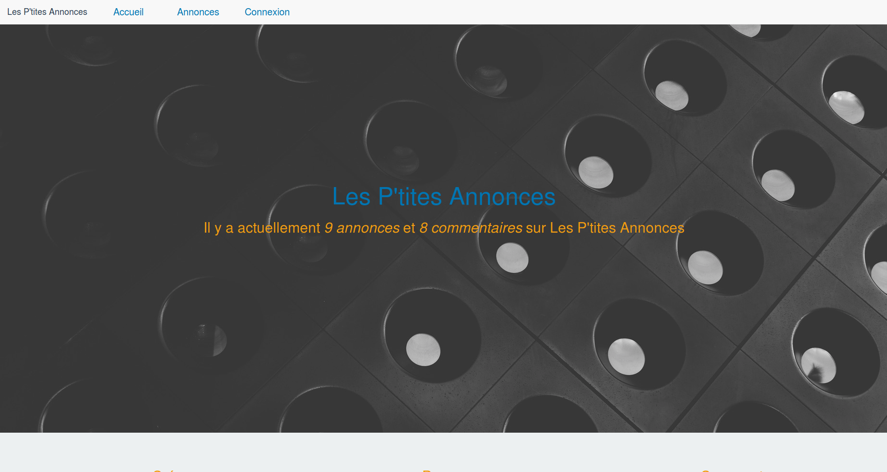

# README

This is a small Ruby on Rails project, this web application is an advert one. You can basically create adverts, look through all published ads, register, connect to the account you created, post comments on ads, logout, etc...

Petit projet Ruby on Rails, il s'agit d'une web app qui permet de poster des annonces, d'en consulter (si elles sont publiées au préalable), de créer un compte, s'y connecter, de commenter, se déconnecter, etc...

here is the landing page : 
